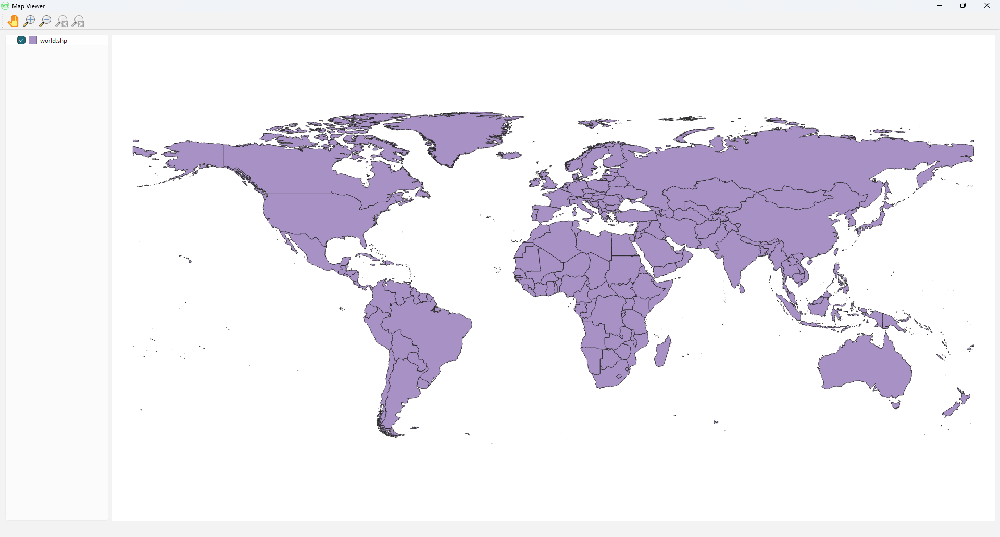

# qgis-qt-mapviewer-demo

A minimal Qt C++ demo application showing how to embed a QGIS map canvas and display a shapefile using the QGIS C++ API.

## 🧰 Tech Stack
- Qt 5 / Qt 6 (Widgets)
- QGIS C++ API (`qgis_core`, `qgis_gui`)
- GDAL and PROJ dependencies
- Built using qmake
- Compiler:  
  - **MinGW64** (Linux/Ubuntu)  
  - **Visual Studio 2022** (Windows)

## 🚀 Features
- Loads and renders a shapefile layer on a `QgsMapCanvas`
- Supports **EPSG:4326** coordinate reference system
- Demonstrates integration with:
  - `QgsVectorLayer`
  - `QgsProject`
- Basic map interaction

## 📦 Prerequisites
- Qt 5 / 6 (with qmake installed)
- QGIS-DEV libraries installed via:
  - OSGeo4W (Windows)
  - System packages (Linux)
- C++17-compatible compiler
- ✅ Add the following to your `PATH` environment variable:
  - Qt6 library path  
  - QGIS library path  
  - GDAL library path  
  - **OSGeo4W** (Windows only) libraries/DLLs path

## 🛠️ Build Instructions

### Step 1: Clone the repository

### Step 2: Set up Qt Creator kit and run

- Configure Qt Creator with:  
  - **Visual Studio 2022 kit** (Windows) or  
  - **MinGW64 kit** (Linux/Ubuntu)  
- Open the project in **Qt Creator**  
- Compile and run from within Qt Creator  

## 📂 Sample Shapefile

A sample shapefile (`world.shp`, `world.dbf`, `world.shx`) is included in the `shapefiles/` directory.  
You can also replace it with your own shapefile by updating the path in `mainwindow.cpp`.  

## 🧾 License

This project is licensed under the MIT License.  
See the [LICENSE](LICENSE) file for more details.

## 💬 Contact

**Manya Technologies**  
🌐 [https://manyatechnologies.com](https://manyatechnologies.com)  
📧 business@manyatechnologies.com

